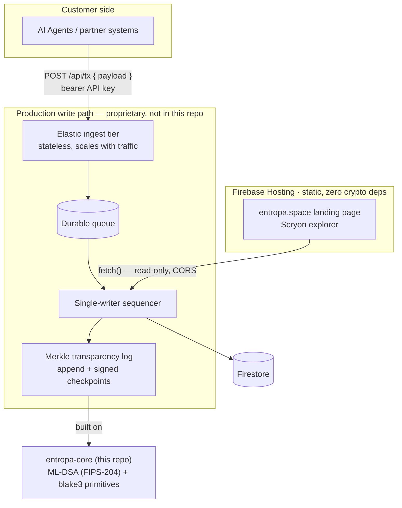
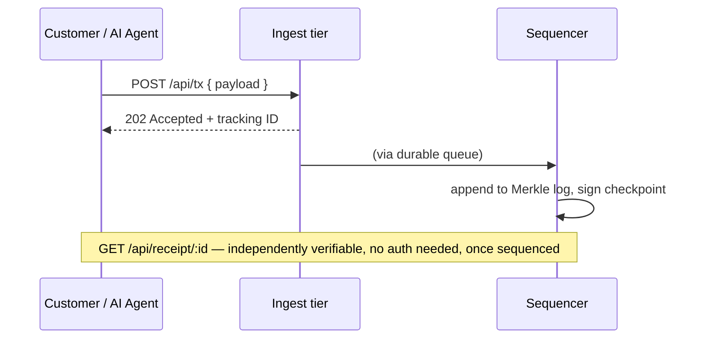

# Entropa — Architecture

*A signed, append-only Merkle transparency log — every record independently verifiable,
post-quantum secure.*
100% Rust · headless · data-minimal · no token.

## System

**Updated 2026-08-26.** The crates in this repo are real, working, MIT-licensed
open-core primitives (see `README.md` § Project status) — they are not, however, a
complete picture of the current production system, which moved to a private,
proprietary architecture. The diagram below shows the real current shape at the level
this repo can honestly show it: what's a public crate here is labeled as such; what's
proprietary is labeled as a black box, not hidden or pretended away.

**Why a queue sits between accepting a submission and writing it**: the log itself is a
single writer by design — one correct, strictly-ordered structure, no multi-party
consensus needed, since there's only ever one operator. That's what keeps the whole
system simple and cheap. But a single writer alone can't elastically absorb a real
traffic burst from many customers at once. The ingest tier is genuinely elastic (Cloud
Run, scales with demand); the queue lets it accept a submission immediately even if the
single-writer sequencer is momentarily behind — a delayed record, never a dropped one.
Full story, including the real load-testing that found this mattered:
[`OBSERVABILITY.md`](OBSERVABILITY.md#why-the-production-architecture-changed-twice-in-one-week-2026-08-2526--the-full-story).

**Historical note, corrected 2026-08-23**: the public website and the production
write path used to be deployed as *literally the same process*, routed by HTTP `Host`
header — a real architectural mistake present since this project's first deploy. See
`OBSERVABILITY.md` § Known failure modes, 2026-08-12 → 2026-08-23 row, for the honest
account. Fixed the same day; the diagram above reflects the corrected, separated
topology, which has held through every architecture change since.

## The "prove it, don't trust me" flow

## Crates (cargo workspace)

| Crate | Role | Status |
|---|---|---|
| `entropa-core` | ML-DSA/FIPS-204 Probe identities, transactions, blocks, verifiable chain — the cryptographic primitives the current production log is built on, real and still used | ✅ 10 tests + 5 NIST KAT tests |
| `entropa-node` | mempool + **Proof of Entropy** consensus — real, working, but **not part of the current production architecture** (see `README.md` § Project status; kept here as a valid, maintained demo of the original consensus design) | ✅ 5 tests |
| `entropa-agents` | AI Probes — production `GeminiBrain` (Vertex AI) + offline `MockBrain`. Also not part of the current production system — the current write path makes no AI-driven decisions at all | ✅ 5 tests |
| `entropa-api` | axum JSON gateway + **Scryon** explorer, per-key rate limiting — this demo build's own self-contained API; the real production API is a different, private service (see § System above) | ✅ 12 tests |

Product surface: **Scryon** (the explorer). No smart-contract DSL, no wallet — Entropa does one thing.

## Repo split — public vs. proprietary source

**`.gitignore` does not hide already-committed code** — a crate marked `UNLICENSED` in `Cargo.toml` is still
fully readable in git history once pushed. So the split is by **directory + pipeline**, not by license label:

| Piece | Lives in | Ships via |
|---|---|---|
| `entropa-core`, `entropa-node`, `entropa-api`/Scryon, docs | `~/entropa-public/` → GitHub `aimozart/entropa-public` | public repo |
| `entropa-agents` (the real Probe brain) + private planning docs | `~/entropa-chain/` → **private** source (Gitea) | never touches GitHub |
| Production build | **Cloud Build**, from the private source directly (`gcloud run deploy --source=...`) | compiles the container |
| Runtime | **Cloud Run**, serves the compiled image | — |

The proprietary Rust source for `entropa-agents` is never uploaded anywhere public or semi-public — only a
compiled container image moves through the GCP pipeline. The two repos are kept in sync by hand for the shared
crates (`core`/`node`/`api`); `entropa-api/src/main.rs` is the one deliberate exception that's allowed to
diverge, since the public build is self-contained (no `entropa-agents` dependency) and the private build wires
in the real brain.

## Build & infrastructure

- **App:** 100% Rust. Multi-stage **Docker** (`cargo build --release`).
- **Runtime:** GCP **Cloud Run** — scale-to-zero, pay-per-request, no VMs to burn.
- **State:** Firestore (`crates/api/src/persistence.rs`) — each block is its own document, written once and
  never rewritten (a save is O(1), not a re-upload of the whole chain). A redeploy resumes instead of
  resetting. Replaced an earlier single-GCS-blob approach that re-uploaded the entire chain on every block —
  fine for a demo, would not have scaled.
- **No IaC layer.** The footprint is one Cloud Run service, one Firestore database, a few DNS records —
  `gcloud run deploy --source=...` *is* the reproducible-deploy story at this scale. Pulumi/Terraform were
  considered and deliberately dropped: real infra-as-code earns its keep once there's infra worth
  abstracting, and there isn't, yet.
- **Language policy:** **Rust for everything else** (`core`, `node`, `agents`, `api`). Not boxed in —
  **C/C++ permitted only where warranted** (a perf-critical primitive, or a mature C library with no good Rust
  equivalent). Default is Rust; reach for C/C++ deliberately, never by habit.

## Cryptographic assurance

- Signatures: **ML-DSA (NIST FIPS-204)** via the RustCrypto `ml-dsa` crate.
- **NIST KAT vectors:** add FIPS-204 known-answer tests that run NIST's official ML-DSA vectors and assert our
  signing matches — provable compliance ("built, not certified"), mirroring old Entropa.
- Hashing: **blake3**; chain is deterministic and fully replayable (`chain.verify()`).
