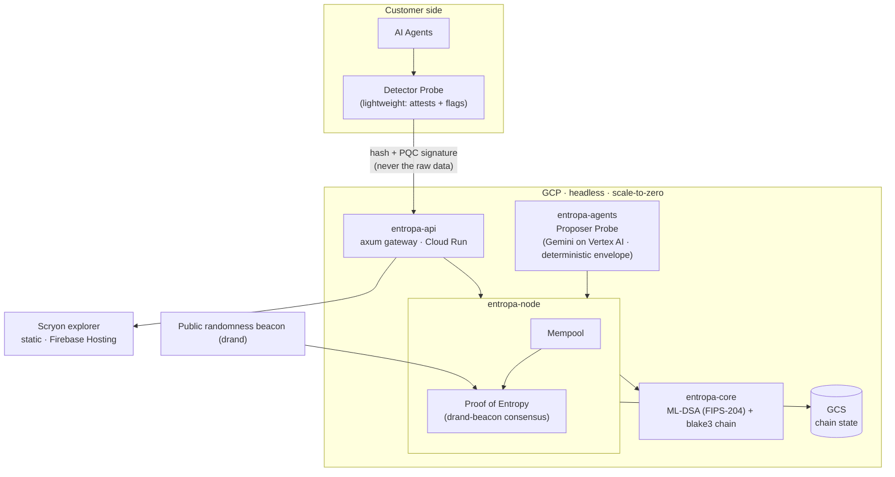
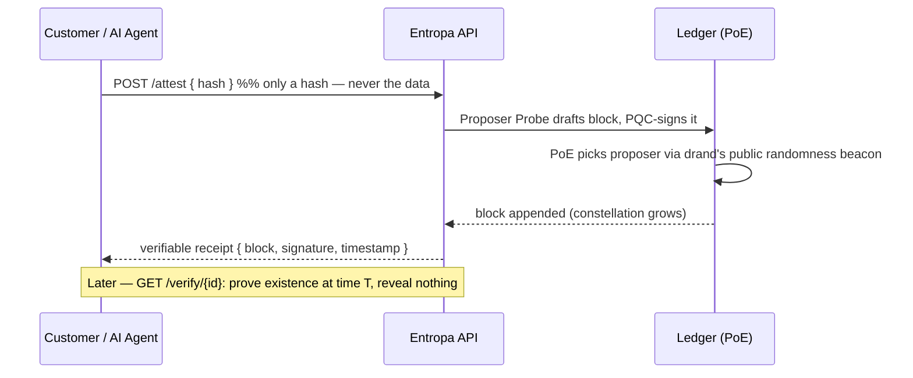

# Entropa — Architecture

*"AI probes reach post-quantum consensus, seeded by a public randomness beacon."*
100% Rust · headless · data-minimal · no token.

## System

## The "prove it, don't trust me" flow

## Crates (cargo workspace)

| Crate | Role | Status |
|---|---|---|
| `entropa-core` | ML-DSA/FIPS-204 Probe identities, transactions, blocks, verifiable chain | ✅ 10 tests |
| `entropa-node` | mempool + **Proof of Entropy** consensus | ✅ 5 tests |
| `entropa-agents` | AI Probes — production `GeminiBrain` (Vertex AI) + offline `MockBrain`; `ClaudeBrain` ships too but is a local/offline build-time tool only, never deployed | ✅ 4 tests |
| `entropa-api` | axum JSON gateway + **Scryon** explorer | ✅ live |

Product surface: **Scryon** (the explorer). No smart-contract DSL, no wallet — Entropa does one thing.

## Repo split — public vs. proprietary source

**`.gitignore` does not hide already-committed code** — a crate marked `UNLICENSED` in `Cargo.toml` is still
fully readable in git history once pushed. So the split is by **directory + pipeline**, not by license label:

| Piece | Lives in | Ships via |
|---|---|---|
| `entropa-core`, `entropa-node`, `entropa-api`/Scryon, docs | `~/entropa-public/` → GitHub `aimozart/entropa-public` | public repo |
| `entropa-agents` (the real Probe brain) + private planning docs | `~/entropa-chain/` → **private** source (Gitea) | never touches GitHub |
| Production build | **Cloud Build**, from the private source directly (`gcloud run deploy --source=...`) | compiles the container |
| Runtime | **Cloud Run**, serves the compiled image | — |

The proprietary Rust source for `entropa-agents` is never uploaded anywhere public or semi-public — only a
compiled container image moves through the GCP pipeline. The two repos are kept in sync by hand for the shared
crates (`core`/`node`/`api`); `entropa-api/src/main.rs` is the one deliberate exception that's allowed to
diverge, since the public build is self-contained (no `entropa-agents` dependency) and the private build wires
in the real brain.

## Build & infrastructure

- **App:** 100% Rust. Multi-stage **Docker** (`cargo build --release`).
- **Runtime:** GCP **Cloud Run** — scale-to-zero, pay-per-request, no VMs to burn.
- **State:** GCS (`crates/api/src/persistence.rs`) — a redeploy resumes the chain instead of resetting it.
- **No IaC layer.** The footprint is one Cloud Run service, one bucket, a few DNS records — `gcloud run deploy
  --source=...` *is* the reproducible-deploy story at this scale. Pulumi/Terraform were considered and
  deliberately dropped: real infra-as-code earns its keep once there's infra worth abstracting, and there
  isn't, yet.
- **Language policy:** **Rust for everything else** (`core`, `node`, `agents`, `api`, `veyl`). Not boxed in —
  **C/C++ permitted only where warranted** (a perf-critical primitive, or a mature C library with no good Rust
  equivalent). Default is Rust; reach for C/C++ deliberately, never by habit.

## Cryptographic assurance

- Signatures: **ML-DSA (NIST FIPS-204)** via the RustCrypto `ml-dsa` crate.
- **NIST KAT vectors:** add FIPS-204 known-answer tests that run NIST's official ML-DSA vectors and assert our
  signing matches — provable compliance ("built, not certified"), mirroring old Entropa.
- Hashing: **blake3**; chain is deterministic and fully replayable (`chain.verify()`).
