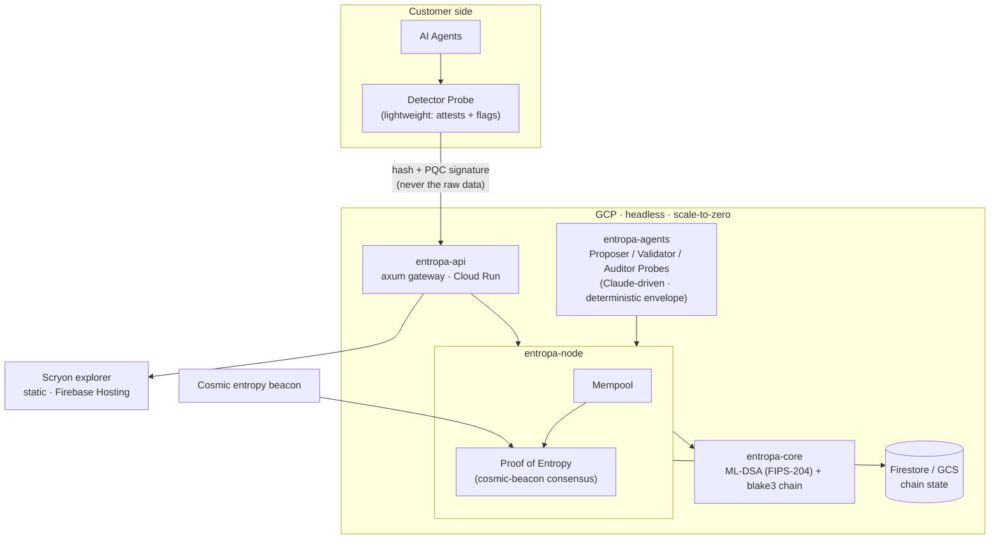
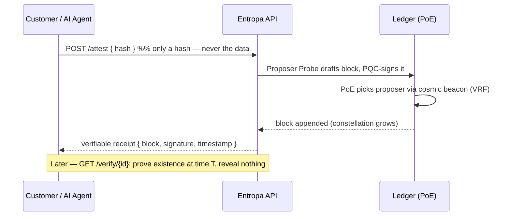

# Entropa — Architecture

*"AI probes reach post-quantum consensus, seeded by the entropy of space."*
100% Rust · headless · data-minimal · no token.

## System

## The "prove it, don't trust me" flow

## Crates (cargo workspace)

| Crate | Role | Status |
|---|---|---|
| `entropa-core` | ML-DSA/FIPS-204 Probe identities, transactions, blocks, verifiable chain | ✅ 10 tests |
| `entropa-node` | mempool + **Proof of Entropy** consensus | ✅ 5 tests |
| `entropa-agents` | AI Probes — Claude Proposer + offline MockBrain | ✅ 4 tests |
| `entropa-api` | axum JSON gateway + **Scryon** explorer | 🚧 WIP |
| `entropa-veyl` | **Veyl** — smart-contract DSL | planned |

Product surface: **Scryon** (explorer) · **Veyl** (contract DSL) · **Entrove** (wallet).

## Repo split — public vs. proprietary source

**`.gitignore` does not hide already-committed code** — a crate marked `UNLICENSED` in `Cargo.toml` is still
fully readable in git history once pushed. So the split is by **directory + pipeline**, not by license label:

| Piece | Lives in | Ships via |
|---|---|---|
| `entropa-core`, `entropa-node`, `entropa-api`/Scryon, docs | `~/entropa-public/` → GitHub `aimozart/entropa` | public repo |
| `entropa-agents` (Probe brain) + private planning docs (`SESSION_STATE.md`, `MILESTONES.md`, `PROMO.md`) | `~/entropa-chain/` → **private** source (Gitea) | never touches GitHub |
| Proprietary build | **Cloud Build**, triggered from the private Gitea source | compiles the container |
| Proprietary artifact | **Artifact Registry** (private repo) | only the *compiled image* exists here — source never leaves Gitea |
| Runtime | **Cloud Run**, pulls from Artifact Registry | — |

The proprietary Rust source for `entropa-agents` is never uploaded anywhere public or semi-public — only a
compiled container artifact moves through the GCP pipeline. **`~/entropa-public/` split is a TODO** — see
`SESSION_STATE.md`.

## Build & infrastructure

- **App:** 100% Rust. Multi-stage **Docker** (`cargo build --release`).
- **Runtime:** GCP **Cloud Run** — scale-to-zero, pay-per-request, no VMs to burn.
- **Registry:** Artifact Registry. **State:** Firestore or GCS. **Static Scryon:** Firebase Hosting.
- **IaC:** **Pulumi (Go)** is the infrastructure base — provisions the GCP resources (Cloud Run, Artifact
  Registry, Firestore/GCS, Firebase Hosting). *(Pulumi has no production Rust SDK; Go is its systems-grade
  language.)*
- **Language policy:** **Rust for everything else** (`core`, `node`, `agents`, `api`, `veyl`). Not boxed in —
  **C/C++ permitted only where warranted** (a perf-critical primitive, or a mature C library with no good Rust
  equivalent). Default is Rust; reach for C/C++ deliberately, never by habit.

## Cryptographic assurance

- Signatures: **ML-DSA (NIST FIPS-204)** via the RustCrypto `ml-dsa` crate.
- **NIST KAT vectors:** add FIPS-204 known-answer tests that run NIST's official ML-DSA vectors and assert our
  signing matches — provable compliance ("built, not certified"), mirroring old Entropa.
- Hashing: **blake3**; chain is deterministic and fully replayable (`chain.verify()`).
